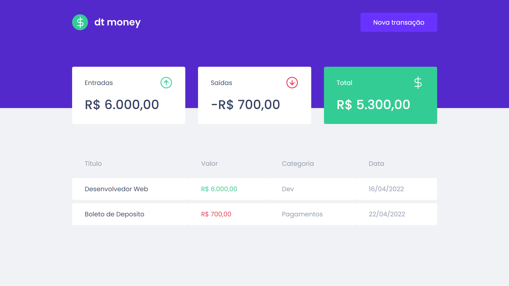
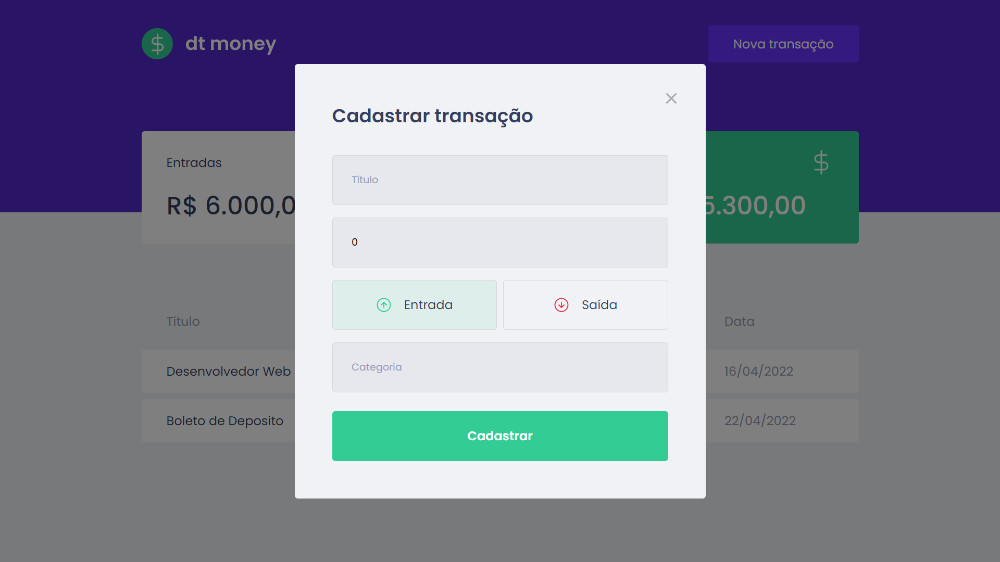

# 🚀 Projeto DtMoney

  Este projeto foi densenvoldo para fazer o cadastro e o controle dos gastos, armazenando os dados em uma API fake, com o MirageJS, asssim podendo cadastrar os dados através de um formulário e logo exibindo em uma tabela e fazendo os cálculos para mostrar em tempo real o saldo.

## 📸 Layout da Aplicação

  
  

## 🛠️ Ferramentas Utilizadas

  <ul>
    <li>React</li>
    <li>React Hooks</li>
    <li>Typescript</li>
    <li>MirageJS</li>
    <li>Axios</li>
    <li>Pullstate</li>
  </ul>

## 👦 Autor 

  Tiago Mota